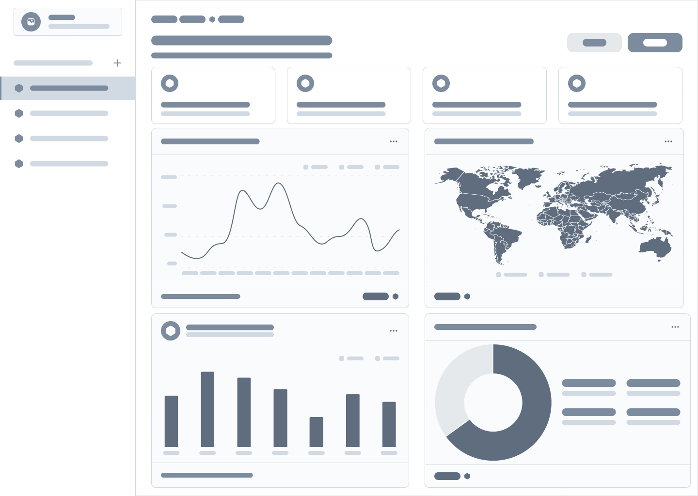

# Online Retail Analysis

**Online Retail Analysis** is a tool designed to inform business decisions through data analysis and visualisation. This tool is built using Python, Pandas, Plotly, Seaborn, Matplotlib, and Tableau. This tool reads from a raw CSV file, processes the data and shows visualisation insights in a Jupyter Notebook and a Tableau dashboard.

## Table of Contents

  
Click here to expand the contents

- [Project Outcomes and Key Findings](#project-outcomes-and-key-findings)
- [Dataset Content](#dataset-content)
- [Business Requirements](#business-requirements)
- [Hypothesis and Validation](#hypothesis-and-validation)
- [Project Plan](#project-plan)
- [The rationale to map the business requirements to the data visualisations](#the-rationale-to-map-the-business-requirements-to-the-data-visualisations)
- [Analysis Techniques Used](#analysis-techniques-used)
- [Ethical Considerations](#ethical-considerations)
- [Dashboard Design](#dashboard-design)
- [Wireframe](#wireframe)
- [Tableau Dashboard](#tableau-dashboard)
- [Kanban Board](#kanban-board)
- [Unfixed Bugs](#unfixed-bugs)
- [Development Roadmap](#development-roadmap)
- [Main Data Analysis Libraries](#main-data-analysis-libraries)
- [Credits](#credits)
  - [Contributors](#contributors)

## Project Outcomes and Key Findings  

- **Seasonality:** Sales dipped after December 2010 but recovered steadily, with a strong surge in Q4 2011, peaking in November due to holiday demand.  
- **Product insights:** The top-selling products were not always the highest revenue generators, highlighting the need for balanced inventory planning.  
- **Pricing effects:** A general negative correlation between price and sales volume was observed, though premium products still performed well due to brand or loyalty factors.  
- **Customer segmentation:** A small group of high-value customers contributed disproportionately to revenue, suggesting opportunities for retention and targeted marketing.  

## Dataset Content
* [Online Retail Dataset](https://www.kaggle.com/datasets/abhishekrp1517/online-retail-transactions-dataset)

The dataset contains transactional data from a UK-based online retail store. It includes information about customers, products, and transactions, with the following key features:

- **InvoiceNo**: Unique identifier for each transaction
- **StockCode**: Unique identifier for each product
- **Description**: Text description of the product
- **Quantity**: Number of units sold
- **InvoiceDate**: Date and time of the transaction
- **UnitPrice**: Price per unit of the product
- **CustomerID**: Unique identifier for each customer
- **Country**: Country of the customer

## Business Requirements
As this is an online retail analysis project, the business requirements are:
1. **Sales Performance Analysis**: Analyse sales trends over time, identify peak sales periods
2. **Enhancing Customer Retention**: Identify repeat customers, analyse customer purchase behavior such as frequency and value of purchases
3. **Product Performance**: Identify top-selling products, analyse product categories, and assess inventory turnover rates
4. **Geographical Insights**: Analyse sales performance by country or region to determine where to focus marketing efforts
5. **Inventory Management**: Use sales data to inform inventory decisions, such as which products to stock more of and which to discontinue

## Hypothesis and Validation

* **Hypothesis 1** - The most popular products generate higher revenue during a particular season in the year, highlighting the importance of aligning inventory and marketing strategies with seasonal buying behaviour. 

* **Hypothesis 2** - The drive for the majority of the revenue comes from the contributions made by the top 10% of customers.

* **Hypothesis 3** - Q4 of the year (Oct-Dec) has an increase in sales due to the seasonal holidays

* **Hypothesis 4** - Customers who purchase more frequently tend to spend more per transaction 

Validation for these hypotheses listed above will be demonstrated using various visualisations and commentary within the data visualisations Jupyter Notebook. This will help the team to understand whether they are true or false. 

## Project Plan
1. **Data Collection** 
    * Gather the dataset from Kaggle
2. **Data Cleaning and Preprocessing**
    * Handle missing values, remove duplicates, and correct data types
    * Filter out irrelevant data (e.g., transactions with negative quantities, product descriptions that are not products such as "damages and ?")
    * Create new features (e.g., TotalPrice = Quantity * UnitPrice)
3. **Save the cleaned data to a new CSV file**
4. **Explore Data and Visualise**
    * Use descriptive statistics to understand the data
    * Create visualisations to identify trends and patterns for key insights of the data in line with hypotheses
5. **Dashboard Creation**
    * Use a wireframe and Tableau to plan and create an interactive dashboard that includes key metrics and visualisations in line with the hypotheses
6. **Presentation**
    * Create a presentation with our key insights and conclusions in line with the hypotheses.

## The rationale to map the business requirements to the data visualisations

- Enhance customer retention/engagement
- Optimise product offerings (inventory management)
- Strategic sales growth

The business requirements would be met through understanding the data after processing and visualisations. This gave the team an idea on solutions for the business requirements to be met

It is common in the retail industry to look at sales, seasonality, customers and their characteristics in spending and the products being bought.

## Analysis Techniques Used
- Researching and using the standard key metrics for an online retail industry, this helped reach my objectives and gain a better understanding on the dataset.
- We structured the analysis around what a common retail industry would want to look at and gathered some ideas surrounding the generalised view of the industry. This gave our team a base on structure to go by, sales, products, customers etc.
- Online resources such as YouTube and Google were used for code understanding and helped with code building

## Ethical Considerations
* The dataset came from Kaggle and do not have any legal or societal issues. There was no personal data within the dataset which could expose or identify anything personal to a particular individual.

## Dashboard Design
* The dashboard was designed to be visually appealing, with a consistent colour scheme and layout that enhances the user experience. We kept the design simple and clean, avoiding clutter and unnecessary elements that could distract from the data insights.
* Main board represents the summary of the data for example, total sales, total number of customers, and total number of orders.
* The following visualisation charts were chosen to communicate the insights effectively
    * Monthly Trend Analysis 
    * Top 10 Products: Quantity Sold vs Revenue
    * Total sales from each country is represented on a map
    * Quarterly Revenue.
* All charts have clear titles, labels, and legends to ensure that users can easily understand the information being presented. The interactive elements, such as filters and tooltips, allow users to explore the data in more detail and gain deeper insights.

## Wireframe
* The dashboard wireframe was created in Figma to outline the layout for our Online Retail Analysis project dashboard. It includes key components, such as summary cards and charts. This wireframe will serve as a guide while designing the interactive dashboard in Tableau.

## Tableau Dashboard
* You can find a link to our dashboard [here](https://public.tableau.com/views/Chart_1_17574241391950/Dashboard1?:language=en-GB&:sid=&:redirect=auth&:display_count=n&:origin=viz_share_link)

## Kanban Board
* You can find screenshots of our Kanban board [here](KANBAN.md)
* You can view our project board [here](https://github.com/users/stephenbeese/projects/10/views/2)

## Unfixed Bugs
* We do not have any unfixed bugs.

Some issues we have encountered:
* We have had some issues regarding the Git workflow. When pulling from the origin/main to our individual branches we sometimes had to stash any changes and then either drop or pop them. 
* We would often have to drop our changes and ensure we have a backup so we can make the changes later.

## Development Roadmap
* With the team's skillset and expertise, the team did not encounter any major issues. We were all on call for support where needed with a solid project plan in place. A lot of the issues people may have come across in the first project have been rectified and newly learnt, therefore referring back to experience in these situations was the solution.
* The team plans to learn more about VSCode, dashboarding tools and Python. This would aid in more hands on experience to build more understanding and confidence in completing projects.

## Main Data Analysis Libraries
* Pandas
* NumPy
* Matplotlib
* Seaborn
* Plotly
* Tableau

## Credits 
* Kaggle Dataset: [Online Retail Dataset](https://www.kaggle.com/datasets/abhishekrp1517/online-retail-transactions-dataset)
* Generative AI tools: ChatGPT, GitHub Copilot
* YouTube
* Team members

### Contributors:
- Mahabir Bhakerd - Project Manager / Data Architect / Analyst
- Stephen Beese - Project Manager / Data Architect / Analyst
- Adrian Sorbala - Data Architect / Analyst
- Rana Tahon - Data Architect / Analyst
- Tanzila Chand - Data Architect / Analyst